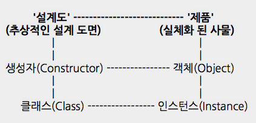

# 생성자 함수와 프로토타입, 공통속성 / 개별속성, this


### 생성자(일급함수객체)
    
- 생성자.prototype -----> 프로토타입 객체 {}
- 객체생성 = new 생성자()

- 생성자로부터 생성된 객체의 모든 능력은 어디서 오는 것인가? (힘의 근원)
    - 생성된객체.constructor
    - 프로토타입 객체

### 추상(설계) vs. 실체(사물)

</img>


### 예시

- 생성자 함수 Dog로 poodle과 beagle이라는 객체를 만든다.
- 생성자 함수 Dog의 프로토타입에 속성을 추가하여 poodle과 beagle의 공통속성을 부여할 수 있다.
- 생성자 함수 Dog의 메소드 내 this는 해당 객체의 인스턴스인 poodle과 beagle을 가리킨다.
- 이를 통해 poodle과 beagle에 각각 개별속성을 부여할 수 있다.

```javascript
// 생성자 함수 Dog
function Dog() {};

// 생성자 함수 Dog로 poodle과 beagle이라는 객체를 만들 수 있다.
// 생성자 함수 Dog의 메소드 내 this는 해당 객체의 인스턴스인 poodle과 beagle을 가리킨다.

// 생성자 함수 Dog로 poodle과 beagle라는 객체를 만듬
var poodle = new Dog();
var beagle = new Dog();

// Dog 생성자 함수의 프로토타입에 jump라는 속성을 부여
// 공통 속성 (jump)
Dog.prototype.jump = true;

poodle.jump = true;
beagle.jump = true;

// 생성자 함수 Dog의 this ---> poodle과 beagle이라는 인스턴스
// 개별 속성 (name, age)
function Dog (i, j) {
    this.name = i;
    this.age = j;
}

var poodle = new Dog("nana", 3);
poodle.name = "nana";
poodle.age = 3;

var beagle = new Dog("dodo", 8);
beagle.name = "dodo";
beagle.age = 8;
```

