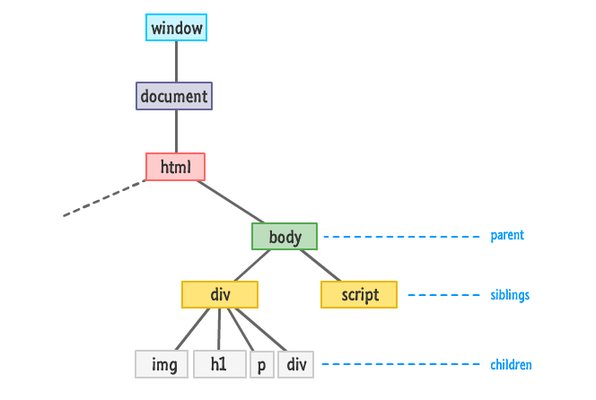

# DOM (Document Object Model)
> : 문서객체모델

## DOM 입문

### Node Tree
    - 가계도와 흡사하다. (parent, child, sibling)
    - 노드의 집합 -----> 문서(document)

</img>

### Node Type
    - 요소노드 (element node) ---> 1
    - 속성노드 (attribute node) ---> 2
    - 텍스트노드 (text node) ---> 3
    - 주석 노드 (comment node) ---> 8

### DOM Script란?
    DOM : 문서의 요소를 선택하여
    -->
    JavaScript : 이벤트 핸들링 및 조작

- DOM --> Property, Method, Event, Event Handler...

## DOM Property

- parentNode
- firstChild
- lastChild
- previousSibling
- nextSibling
- childNodes
- children

### HTML 파일 (Document)

```html
<!DOCTYPE html>
<html lang="ko-KR" class="no-js">
<head>
  <meta charset="UTF-8">
  <meta name="viewport" content="width=device-width, initial-scale=1.0">
  <meta http-equiv="X-UA-Compatible" content="ie=edge">
  <title>DOM 스크립트 &lt; JavaScript 학습</title>
  <link rel="stylesheet" href="study/style.css">
  <script src="study/data.js"></script>
  <script src="../LIBRARY/FDS.js"></script>
</head>
<body>
  <div id="target-parent">
    <h1>
      <abbr title="Document Object Model">DOM</abbr> Script
    </h1>
  </div>
  <nav class="next-target">
    <ul>
      <li><a href="">item 01</a></li>
      <li><a href="">item 02</a></li>
      <li><a href="">item 03</a></li>
      <li><a href="">item 04</a></li>
    </ul>
  </nav>
  <script src="./study/DOM.Script.js"></script>
</body>
</html>
```

### 첫 선언

```javascript
  var html, head, body;
  html = document.documentElement;
  head = document.head;
  body = document.body;
```

### 부모노드(parentNode) 탐색

```javascript
    console.log('h1 요소의 부모의 부모의 부모의 부모는?', headline.parentNode.parentNode.parentNode.parentNode); // #document
    console.log('h1 요소의 부모의 부모의 부모는?', headline.parentNode.parentNode.parentNode); // html
    console.log('h1 요소의 부모의 부모는?', headline.parentNode.parentNode); // body
    console.log('h1 요소의 부모노드는?', headline.parentNode); // div
    console.log('abbr 요소의 부모노드는?', abbr_in_headline.parentNode); // h1
```

### 자식노드(firstChild, lastChild) 탐색

```javascript  
  console.log('headline의 첫번째 자식은?', headline.firstChild); // 공백이 없다면 ? <abbr> : #text
  // 요소인가 텍스트인가 ? ----> 재귀함수 사용
  console.log('headline의 마지막 자식은?', headline.lastChild);  // " Script"
```

### 이전/다음 형제노드(previousSibling, nextSibling) 탐색

```javascript    
    console.log('abbr 요소의 이전 형제:', abbr_in_headline.previousSibling); // #text
    console.log('abbr 요소의 다음 형제:', abbr_in_headline.nextSibling); // " Script"
```

### 자식노드(childNodes) 탐색

```javascript
    console.log('h1 요소의 자식들', headline.childNodes); // NodeList(3)
    console.log('h1 요소의 자식들은 배열인가?', Array.isArray(headline.childNodes)); // false
    console.log('h1 요소의 자식들은 몇 개인가?', headline.childNodes.length); // 3
```

### 자식노드들 중에서 요소노드만 골라내는 함수 만들기

- 순환문을 돌려 요소 노드만 별도로 수집한 객체를 변수에 참조한다.

```javascript
  function onlyElementNodeCollection(el) {
    if ( !el || el.nodeType !== 1 ) { throw '요소노드를 전달하세요'; }
    var el_childs = el.childNodes;
    var collection = [];
    for ( var i=0, l=el_childs.length; i<l; i++ ) {
      var child = el_childs[i];
      if ( child.nodeType === 1 ) {
        collection.push(child);
      }
      // if ( child.nodeType !== 1 ) { continue; }
      // collection.push(child);
    }
    return collection;
  }
}) (window);
```

### DOM API 탐색(Travelsing) 속성 ( childNodes VS children )

- childNodes : 모든 자식 노드를 반환
- children : 자식들 중에서 요소노드만 반환

```javascript
;(function(global){
  'use strict';
  var document = global.document;
  var target = document.getElementById('target-parent');
  console.log('target.childNodes:', target.childNodes);
  console.log('target.children:', target.children);

  console.log('target.firstChild === target.childNodes[0]:', target.firstChild === target.childNodes[0]);
  console.log('target.lastChild === target.childNodes[target.childNodes.length - 1]:', target.lastChild === target.childNodes[target.childNodes.length - 1]);

}) // (window);
```

## Node Information

- nodeName
- nodeType
- nodeValue

- 요소와 요소 사이에 공백이 있을 때와 없을 때, 차이점 주의!

```javascript
  var target_parent, target_headline, target_abbr;

  target_parent   = document.getElementById('target-parent');
  target_headline = target_parent.firstChild;
  target_headline = target_parent.getElementsByTagName('h1').item(0);
  target_abbr     = target_headline.firstChild;
  target_abbr     = target_headline.getElementsByTagName('abbr')[0];

  console.log('target_parent.nodeName:',target_parent.nodeName);    //  nodeName  : DIV, tagName (DOM Lv3까지 표준)
  console.log('target_parent.localName:',target_parent.localName);  //  nodeName  : div  // IE 검증 필요
  console.log('target_parent.nodeType:',target_parent.nodeType);    //  nodeType  : 1 === document.ELEMENT_NODE
  console.log('target_parent.nodeValue:', target_parent.nodeValue); //  nodeValue : null

  console.log('target_headline.nodeName:',target_headline.nodeName);    //  nodeName  : #text | H1
  console.log('target_headline.nodeType:',target_headline.nodeType);    //  nodeType  : 3     | 1
  console.log('target_headline.nodeValue:', target_headline.nodeValue); //  nodeValue :       | null

  // TypeError 오류 발생: Cannot read property 'nodeName' of null
  console.log('target_abbr.nodeName:',target_abbr.nodeName);    //  nodeName  : Error | ABBR
  console.log('target_abbr.nodeType:',target_abbr.nodeType);    //  nodeType  : Error | 1
  console.log('target_abbr.nodeValue:', target_abbr.nodeValue); //  nodeValue : Error | null
```

- 요소노드는 nodeType 속성 값이 1 이며, nodeName 값은 요소의 이름을 대문자로 반환한다.
- 요소노드는 nodeValue 속성 값을 가지지 않지만, textContent, innerText 속성으로 값을 도출할 수 있다.
- 텍스트노드는 nodeType 속성 값이 3 이며, nodeName 속성 값은 '#text' 를 반환한다.
- 텍스트노드는 nodeValue 속성 값을 문자 값으로 반환한다.


## id(), tag() 유틸리티 함수 만들기

- getElementById(), getElementsByTagName() 역할의 함수를 만든다.

```javascript
;(function(global){
  'use strict';

  var document = global.document;

  var id, tag, tagAll;

  id = function(name) {
    return document.getElementById(name);
  };
  tagAll = function(name, context) {
    return (context || document).getElementsByTagName(name);
  };
  // 상위요소에서 찾거나, 혹은 문서 전체에서 찾음
  tag = function(name, context) {
    return tagAll(name, context)[0];
  };
}) // (window);
```

## 네이스페이스 객체에 유틸리티 함수 만들기

### DOM 선택 API: 유틸리티 함수
```javascript  
  function id(name) {
    validateError(name, '!string', '전달인자는 문자여야 합니다.');
    return document.getElementById(name);
  }
  function tagAll(name, context) {
    validateError(name, '!string', '전달인자는 문자여야 합니다.');
    if ( context && !isElNode(context) ) {
      throw '두번째 전달인자는 요소노드여야 합니다.';
    }
    return (context||document).getElementsByTagName(name);
  }
  function tag(name, context) {
    return tagAll(name, context)[0];
  }
```

### DOM 탐색 API: 유틸리티 함수

- 전달인자 검증 ( validateElNode 함수 사용 )
- Modern 브라우저 : firstElementChild, lastElementChild, nextElementSibling, previousElementSibling
- IE 8 이하 지원하는 크로스 브라우징 유틸리티 함수 만들기

```javascript

  var firstChild = function(){
    var _firstChild = null;
    // 조건을 1번만 확인
    if ( 'firstElementChild' in Element.prototype ) {
      _firstChild = function(el_node) {
        validateElNode(el_node);
        return el_node.firstElementChild;
      };
    } else {
      _firstChild = function(el_node) {
        validateElNode(el_node);
        return el_node.children[0];
      };
    }
    return _firstChild;
  }();
  var lastChild = function(){
    var _lastChild = null;
    if ( 'lastElementChild' in Element.prototype ) {
      _lastChild = function(el_node) {
        validateElNode(el_node);
        return el_node.lastElementChild;
      };
    } else {
      _lastChild = function(el_node) {
        validateElNode(el_node);
        var children = el_node.children;
        return children[ --children.length ];
      };
    }
    return _lastChild;
  }();
  var nextSibling = function($$) {
    var _nextSibling;
    if ( 'nextElementSibling' in $$ ) {
      _nextSibling = function(el_node) {
        validateElNode(el_node);
        return el_node.nextElementSibling;
      };
    } else {
      _nextSibling = function(el_node) {
        validateElNode(el_node);
        do {
          el_node = el_node.nextSibling;
        } while(el_node && !isElNode(el_node));
      };
      return el_node;
    }
    return _nextSibling;
  }(Element.prototype);

  var previousSibling = function() {
    var _previousSibling;
    if ( 'previousElementSibling' in Element.prototype ) {
      _previousSibling = function(el_node) {
        validateElNode(el_node);
        return el_node.previousElementSibling;
      };
    } else {
      _previousSibling = function(el_node) {
        validateElNode(el_node);
        do {
          el_node = el_node.previousSibling;
        } while(el_node && !isElNode(el_node));
        return el_node;
      };
    }
    return _previousSibling;
  }();
```
