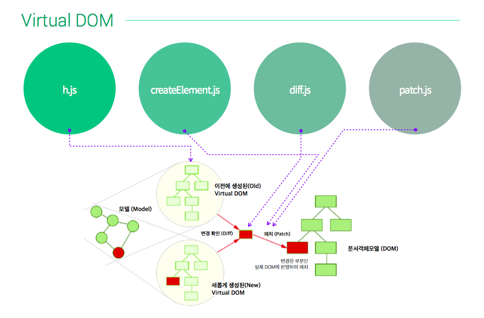

## Virtual DOM
> 애플리케이션의 DOM을 선언적으로 표현할 수 있도록 설계된 모듈 모음

</img>


### Virtual DOM 제어 예시코드

- CommonJS 방식의 모듈 로드

```javascript
const h             = require('virtual-dom/h');
const createElement = require('virtual-dom/create-element');
const diff          = require('virtual-dom/diff');
const patch         = require('virtual-dom/patch');

// 데이터
let count = 0;

let frameworks = 'vue react angular riot polymer'.split(' ');

// 가상 DOM 트리 생성
let vtree = render(frameworks);

// 가상 DOM 트리를 실제 DOM으로 생성
let rootTree = createElement(vtree);

// 마운트 요소(실제)에 rootTree 마운팅
let mount_v_el = document.querySelector('.virtual-dom');
mount_v_el.appendChild(rootTree);

// render 함수는 가상 DOM 트리를 반환
function render(data) {
  let lists = data.map((item, index) => h('li', [
    item,
    h('button',{
      type: 'button',
      onclick: e => {
        data.splice(index, 1);
        update();
      }
    }, 'Delete')
  ]));

  let ul = h('ul', lists);

  let input = h('input.user-input',{
    type: "text",
    placeholder: 'Add Content'
  });

  let add_btn = h('button',{
    type: 'button',
    onclick: e => {
      let input = document.querySelector('.user-input');
      data.unshift(input.value);
      input.value = '';
      update();
    }
  }, 'Add');

  let container = h('.container', [
    input,
    add_btn,
    ul
  ]);

  return container;

}

// 데이터 변경에 따른 가상 DOM 업데이트
function update() {

  // 데이터 변경에 따른 가상 DOM 생성
  let ctree = render(frameworks);

  // 가상 DOM 비교(diff)
  // vtree    VS    ctree
  let patches = diff(vtree, ctree);
  // console.log('patches:', patches);

  // 변경이 있다면, 패치(patch)
  // newRootTree = rootTree <- patches {}
  rootTree = patch(rootTree, patches);
  // console.log(rootTree);

  // ctree는 현재 DOM의 위치에서 과거의 DOM으로 변경
  vtree = ctree;
}
```