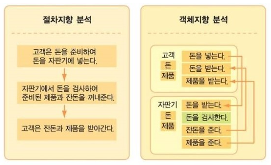
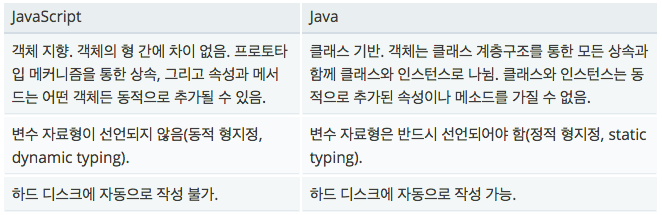

# 입문

### 1. JavaScript 언어란?
> 객체 지향 스크립트 언어
- 호스트 환경(웹 브라우저) 내에서 프로그램 제어를 위해 그 환경의 객체에 연결될 수 있다.
- Node.js와 같은 런타임 환경과 같이, 서버 사이드 네트워크 프로그래밍에도 사용되고 있다. 
- 최초 개발자 : 브랜던 아이크 (Brendan Eich)
- Mocha > LiveScript > JavaScript


 \* 객체 지향 vs. 절차 지향

 </img>

 [이미지 출처 링크](http://blog.naver.com/atalanta16/220249264429)

### 2. JavaScript 와 JAVA 는 다른가?
- C 언어의 기본 구문을 바탕으로 했기 때문에 구문(Syntax)이 유사한 점이 있다. 그러나 근본적으로 다른 언어이다.


 </img>

 [이미지 출처 링크](https://developer.mozilla.org/ko/docs/Web/JavaScript/Guide/%EC%86%8C%EA%B0%9C)


### 3. JavaScript 와 ECMAScript 같은 건가?
- JavaScript는 표준화된 국제 프로그래밍 언어를 제공하기 위해 Ecma International에서 표준화 된다. ECMAScript라 불리는 이 JavaScript의 표준화 버전은 표준을 지원하는 모든 어플리케이션에서 같은 방식으로 동작한다.

# 문법

## 변수 (Variable)

### 1. 정의
> 어플리케이션에서 값에 상징적인 이름으로 변수를 사용한다. 변수명은 식별자(identifier)라고 불리며 특정 규칙을 따른다.

### 2. 변수 선언

#### 1) 초기 값은 할당되지 않는다.

```javascript
var lunch;
// undefined
```

#### 2) 선언된 변수에 값을 할당

- 할당하는 역할을 수행하는 연산자 : 할당(대입) 연산자

```javascript
lunch = 김밥;
// 김밥 이라는 이름의 변수를 찾는다.
// 선언된 변수가 없으면 참조 오류(Reference Error) 발생
// Uncaught ReferenceError: 김밥 is not defined

lunch = "김밥";
lunch = '김밥';
// 김밥 이라는 문자열 데이터를 찾는다.

lunch = kimbab;
lunch = 'kimbab';
// 아래 영문의 경우도 마찬가지

var 변수_이름 = 값;
var 변수_이름 = 다른_변수_이름;
// 변수를 선언함과 동시에 값을 할당하는 구문
// 다른 변수에 할당된 값을 선언하는 변수에도 할당

var dinner = '치맥'; 
// 점심에 먹은 것을 저녁에도 먹고 싶지 않을 때
var dinner = lunch;
// 점심에 먹은 것을 저녁에도 먹고 싶을 때
```

#### 3) 변수 이름 작성 규칙
- 이름은 알아보기 쉽게, 이해하기 쉽게 명시적으로 지어야 한다.
- 이름은 직관적으로 그것이 무엇을 말하며, 무엇을 행할 수 있는지 알게 지어야 한다.

#### \* 이름 작성 시 주의할 점

\- 공백으로 이름이 구분되게 지어서는 안된다.
```javascript
var my name = 'soyeon1128'; [X]
```

\- 이름을 지을 때 첫 글자가 숫자여서는 안된다.
```javascript
var 101Team = 'IoI'; [X]
var 10px = 'Tem Pixel'; [X]
```

\- 이름 지을 때 사용할 수 있는 특수문자는 정해져 있다.
```javascript
// '_', '$' 을 제외한 다른 특수문자는 사용할 수 없다.
var Team-101 = 'IoI'; [X]
var @design-people = '디자인 피플'; [X]
```

\- 대소문자를 구분하는 JavaScript에서는 이름을 지을 때 관례가 있다.
어긴다고 해서 문법에 오류가 발생하지는 않지만, 오래 전부터 내려오는 관습이 있다.

\- 변수 이름은 _을 사용하여 이름을 구분한다.
* 패턴(Pattern): 사용 빈도가 높음
* Single var pattern : var 변수 선언 키워드를 한 번만 사용하여 변수를 정의하는 패턴
```javascript
var my_name, is_visible, has_children, remote_control;
```

\- 함수 이름은 카멜 케이스(camelCase) 표기법을 사용한다.
```javascript
getName(), setAge(), showMeTheMoney(), blackSheepWall()
```

\- 함수 이름의 첫글자가 대문자인 경우는 특별한 함수일 가능성이 높다.
```javascript
Navigation(), Tabs(), Carousel(), Component(), Vue(), ...
```

### 3. 변수 범위 (Scope)
- 어떤 함수의 바깥에 변수를 선언하면, 현재 문서의 다른 코드에 해당 변수를 사용할 수 있기에 전역 변수라고 합니다. 만약 함수 내부에 변수를 선언하면, 오직 그 함수 내에서만 사용할 수 있기에 지역 변수라고 부릅니다.


#### 1) 전역 변수(Global Variable)
> 모든 구역(Block)에서 접근(Access)이 가능한 변수, 전역 객체의 속성
- 클라이언트 환경(Front-End)
- 전역 객체(Global Object): Window 객체

```javascript
var type_of_my_phone = 'iPhone';
console.log('전역 변수:', type_of_my_phone); 'iphone'
```

#### 2) 지역 변수(Local Variable)
> 특정한 구역(Block)에서만 접근이 가능한 변수

```javascript
//Block 문
{
  var type_of_my_phone = 'Apple Device';
  console.log('블록 내부 변수:', type_of_my_phone); 'Apple Device'
}

console.log('전역 변수는 블록 내부의 변수에 영향을 받았나?:', type_of_my_phone); 'Apple Device' ?
```

### 4. 호이스팅 (Hoisting)
- 변수가 끌어올려 진다.

```javascript
var somthing; undefined

console.log('is exist variable `somthing`?:', somthing);

var somthing = '썸씽';
```

## 상수(Constant)
- 상수는 변수와 유사하나, 읽기 전용(Read Only)이다.
- 한 번 선언된 상수는 재 선언될 수 없다. 뿐만 아니라 다른 값을 할당하는 것도 불가능하다.
- 관례적으로 대문자로만 구성된 이름을 사용하여 변수와 구분 짓는다. (강제성 없음)

```javascript
const IS_ROTATION_EARTH = true; // 대문자로 구성된 상수
const is_rotation_earth = true; // 소문자로 구성된 상수

console.log('IS_ROTATION_EARTH:', IS_ROTATION_EARTH);
console.log('is_rotation_earth:', is_rotation_earth);
```

## 데이터 유형 (Data Types)

### 1. 분류 (ES5 기준)

#### 원시 데이터 유형(Primitive Data Types)
- undefined: false (변수 값이 할당되지 않음)
- null: false (변수 값이 없음)
- Number : (정수, 실수, 소수) / 0: false
- String : 홑따옴표, 쌍따옴표로 묶인 텍스트 / "": false / " ": true
- Boolean : (true, false) / !!false: true

#### 참조 데이터 유형(Reference Data Types)
- Function : 수행을 위한 절차
- Array : 값의 집합
- Object : 속성의 집합


### 2. 문자(String) 유형의 데이터
> 따옴표(큰,작은)로 묶인 텍스트

#### * 사용시 유의점
- 따옴표의 시작과 끝이 같은 유형이어야 한다.
- 문자 데이터 유형을 구분짓기 위한 따옴표가 아닌,문자로서의 따옴표의 경우는 이스케이스(Escape) 처리해야 한다.

```javascript
//다음과 같은 HTML 코드를 문자 데이터 유형으로 처리하려면?
<p class="message" title="달리기 기록">나의 하프 마라톤 기록은 50" 23'이다.</p>

//큰 따옴표 사용 시
var message_html = "<p class=\"message\" title=\"달리기 기록\">나의 하프 마라톤 기록은 50\" 23'이다.</p>";

//작은 따옴표 사용 시
var message_html = '<p class="message" title="달리기 기록">나의 하프 마라톤 기록은 50" 23\'이다.</p>';
```

### 3. 데이터 형 변환(자동)

- JavaScript는 동적 데이터 유형 처리 언어이기 때문에 변수를 사용하여 런타임(실시간, 웹 브라우저에서 실행 중인 상황) 중에 값의 유형을 변경할 수 있다.

```javascript
// 변수 선언 시에 문자 유형의 데이터 값을 변수에 할당했지만,
var process_my_work = '논리에 기반한 선별적 디자인 프로세스';

// 웹 브라우저에서 실행 중인 상황에 사용자의 코드에 따라 값의 유형이 바뀔 수 있다. (너무나 쉽게)
process_my_work = false;          // 문자 -> 불리언 으로 변경
process_my_work = function() {};  // 불리언 -> 함수 로 변경
```

#### * 동적 할당 언어인 JavaScript에서 유의할 점

```javascript
var a, b, c;

a = 10;
b = 7;
c = a + b; 17

a = 10;
b = '칠'; // 사용자가 잘못된 유형을 입력한 경우
c = a + b; '10칠' // 의도치 않는 결과를 가져온다.

Single var pattern
var x, y, z;

x = 'X';
y = 'Y';
z = 'Z';

var x = 'X',
    y = 'Y',
    z = 'Z';
```

## 미리 살펴보는 DOM Script

```javascript
//DOM Script 에서 Single var pattern을 사용한 예시
var html = window.document.documentElement,
    head = window.document.head,
    body = window.document.body;

console.log('html:', html);
console.log('head:', head);
console.log('body:', body);
```
