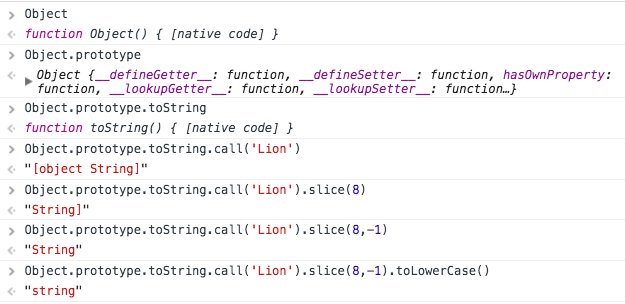
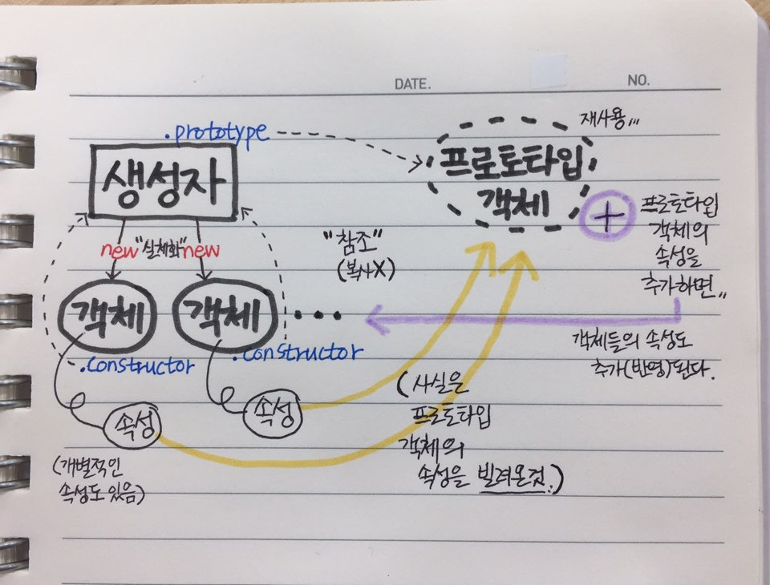

# 연산자

```javascript
var k = 5;

k = k + 2; // 7
k += 3; // 10
k++; // 10
k; // 11
++k; // 12
k--; // 12
--k; // 10
k *= 3; // 30
k %= 4; // 2
```

# 데이터 유형 검증

### 데이터 검증 시뮬레이션을 위한 데이터 객체
```javascript
var types = {
  'num': 19,
  'str': "hi, there",
  'boo': false,
  'fnc': function() {},
  'arr': [],
  'obj': {},
  'nothing': [null, undefined],
  'date': new Date()
};
```

## 1. typeof

- typeof는 함수가 아니다.
- typeof의 괄호()는 함수 실행 연산자가 아니라, 식을 묶기 위한 괄호다.

### 문제점
- null, Array, 그 외 Host Object 를 모두 "object"라고 알려준다.

```javascript
var tester = classUsingArray[8];

console.log('typeof tester.name:', typeof tester.name);
// string
console.log('typeof tester.age:', typeof tester.age);
// number
console.log('typeof tester.family:', typeof tester.family);
// object
console.log('typeof tester.school:', typeof tester.school);
// object
```

## 2. instanceof

- 객체 instanceof 생성자
- 객체를 통해 생성자가 맞는지 검증하는 수단
- 원시 데이터 유형은 객체가 아니므로 instanceof 로 검증할 수 없다.

### Array 올바르게 판별하는 방법
- Array.isArray(data) // true, false (ES5)
- isArray 메서드를 사용. 단, IE9 이상에서만 가능

```javascript
console.log('90 instanceof Number:', 90 instanceof Number);
// false
console.log('new Number(90) instanceof Number:', new Number(90) instanceof Number);
// true
console.log('Number("101") instanceof Number:', Number('101') instanceof Number);
//false

// (ES5) Array 올바르게 판별하는 방법
console.log('Array.isArray(types.arr):', Array.isArray(types.arr));
//true
```


## 3. .constructor (생성자)

- constructor 속성은 모든 객체가 태어날때부터 꼬리표처럼 가지고 태어난다.
- constructor 속성은 객체가 소유한 것이기에, 객체가 아닌 것(null, undefined)은 검증할 수 없을 뿐더러 오류를 발생시킨다.

```javascript
// 객체인 유형
console.log('types.num.constructor:', types.num.constructor === Number);
// true
console.log('types.str.constructor:', types.str.constructor === String);
// true
console.log('types.boo.constructor:', types.boo.constructor === Boolean);
// true
console.log('types.fnc.constructor:', types.fnc.constructor === Function);
// true
console.log('types.arr.constructor:', types.arr.constructor === Array);
// true
console.log('types.obj.constructor:', types.obj.constructor === Object);
// true
console.log('types.date.constructor:', types.date.constructor === Date);
// true

// 객체가 아닌 유형 null, undefined
.constructor 속성은 객체가 소유한 것이기에, 객체가 아닌 것은 검증할 수 없을 뿐더러 오류를 발생시킨다.
console.log('types.nothing[0].constructor:', types.nothing[0].constructor);
// null // 오류 발생
console.log('types.nothing[1].constructor:', types.nothing[1].constructor);
// undefined // 오류 발생
```

## 4. type() 유틸리티 함수

- 함수가 처리하는 로직(Logic) 설계
- 원리 이해, 재사용 가능하게 설정

```javascript
function type("Lion") {
  return Object.prototype.toString.call("Lion").slice(8,-1).toLowerCase();
}
// "string"
```
 </img>


# JavaScript 메서드 빌려쓰기 패턴

```javascript
// 새(객체)를 태어나게 하는 생성자 함수
function Bird() {}
// 새(객체)의 날다 라는 능력 -> 생성자함수.prototype
// 새.날다()
Bird.prototype.fly = function() {};
// 생성자 Bird 함수를 통해 새(객체)를 생체
// var my_bird = new Bird(); // Bird {}

// my_bird.fly();
// my_bird.readBook(); [X]

// 사람.걷다()
function Human(){}
Human.prototype.walk = function() {};
// var me = new Human();

// me.walk();
// me.fly(); // [X]

// Function.prototype.call
// 새.날다.call(사람)

// Bird.prototype.fly.call(me); // me.fly()
```


# 생성자와 객체, 프로토타입 객체

- 올바른 데이터 유형 검증 (심지어 객체가 아닌 것 포함)
- null, undefined 도 검증이 가능하다.

### 생성자(일급함수객체)
    
- 생성자.prototype -----> 프로토타입 객체 {}
- 객체생성 = new 생성자()

- 생성자로부터 생성된 객체의 모든 능력은 어디서 오는 것인가? (힘의 근원)
    - 생성된객체.constructor
    - 프로토타입 객체

</img>
    

### 추상(설계) vs. 실체(사물)

클래스(Class) <------> 생성자(Constructor) <----> 추상적인 설계 도면

인스턴스(Instance) <----> 객체(Object) <--------> 실체화된 사물(제품)


